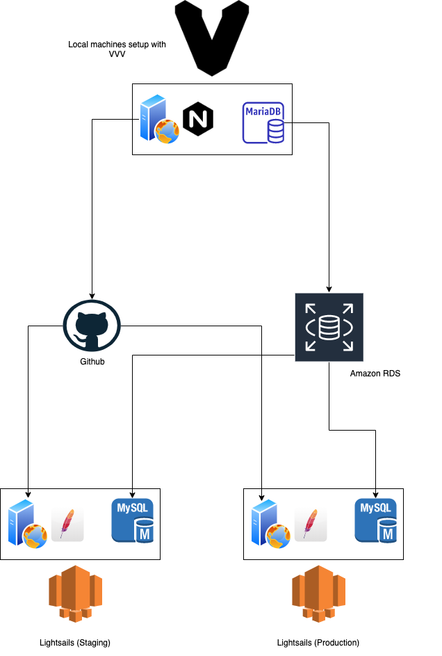

# CMS: Assignmnet 2
## Group 02

------------------------------------
### Group Members -

1. Nyan Ye Htun - nyanyehtun@my.jcu.edu.au
2. Nurul Azzahra Putri - nurulazzahra.putri@my.jcu.edu.au
3. Van Hung Nguyen - vanhung.nguyen2@my.jcu.edu.au
4. Benedict Ryan - benedict.ryan@my.jcu.edu.au
------------------------------------

------------------------------------
## Architecture Diagram

<p align="center">

</p>

<br/>

## Local Environment Setup -
<br/><br/>
**Setting up VVV in your local machine**
<br/>
*run the following commands:*

```
git clone https://github.com/Varying-Vagrant-Vagrants/VVV.git
cd VVV
vagrant plugin install vagrant-hostsupdater --local
vagrant up
```
delete the **wordpress-one** project folder:
```
rm -rf www/wordpress-onecd 
```
Clone the current repo as wordpress project called **wordpress-one**:
```
cd  www
git clone git@github.com:JCUS-CMS/assignment-2-team-02.git wordpress-one
cd ..
```

Now you have successfully setup workpress project on your Vagrant

<br/>

**Note: Work on the WordPress Project called wordpress-one after cloning the repo**

<br/>

##Edit your wp-config.php and change the DB settings to:

```
  define( 'DB_NAME', '<YOUR DB_NAME>' );  
  define( 'DB_USER', '<YOUR DB_USERNAME>' );  
  define( 'DB_PASSWORD', '<YOUR DB_PASSWORD>' );  
  define( 'DB_HOST', '<YOUR DB_SERVER IP>' );  
```

<br/>
  
**Branch setup in the Repo:**

<br/>

There are two branches in use in this repo:<br/>
  
```
-> master (for production)
-> development (for staging)
```
<br/>

## **EXAMPLE - Deployment FOR STAGING**

**Following instructions will only work on Unix/Linux environments (If you are in Vagrant, you are already inside Linux environment already)**

***Make sure you Copy `nyanyehtun-simon.pub` file under (your-home-dir)/.ssh folder before running the deployment script***

```
cd deployment
sh wordpress-deployment.sh <deployment-mode>
```

deployment-mode - can be either `staging` or `production`

Depending on the mode that you choose, it will deploy to respective server.

Staging server link: http://staging.doctorsconnect.nyanyehtun.me/
Production server link: http://prod.doctorsconnect.nyanyehtun.me/

<br/>


------------------------------------
